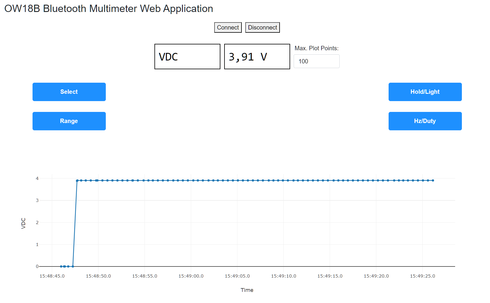

# OW18B

Welcome to the OW18B Bluetooth Multimeter Web Application.

How to:
- Switch on OW18B Device & Enable Bluetooth
- Open up: https://martmet.github.io/OW18B/ble
- Click "Connect" to establish Bluetooth Connection ("BDM" is the default device name)
- Enjoy!

Please note: some blue buttons also have a long press functionality! 

For example: to switch on the light hold down "Hold/Light" for a longer time

OW18B Bluetooth Multimeter            |  OW18B Bluetooth Multimeter Web Application
:-------------------------:|:-------------------------:
  |  

